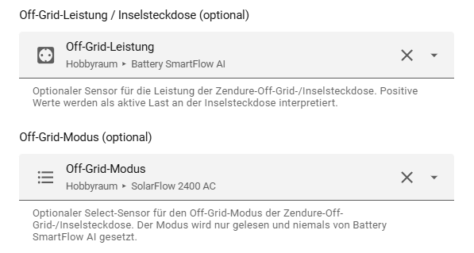
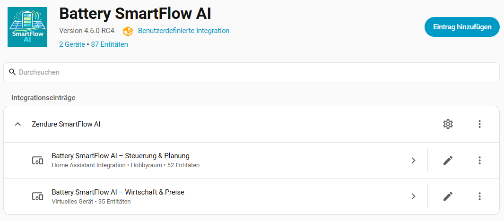
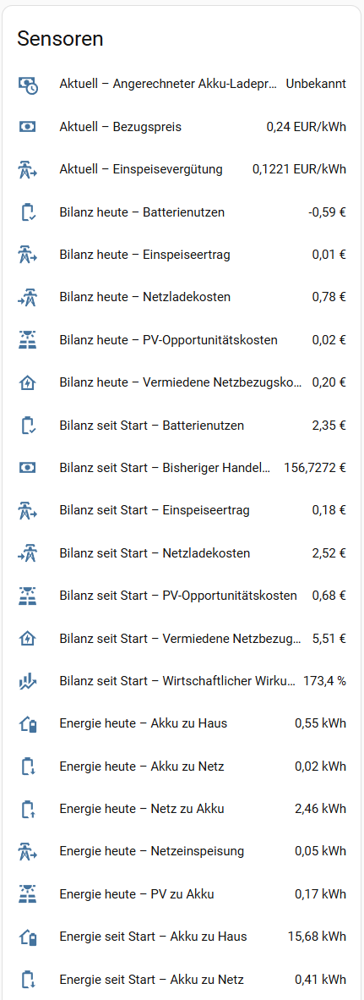
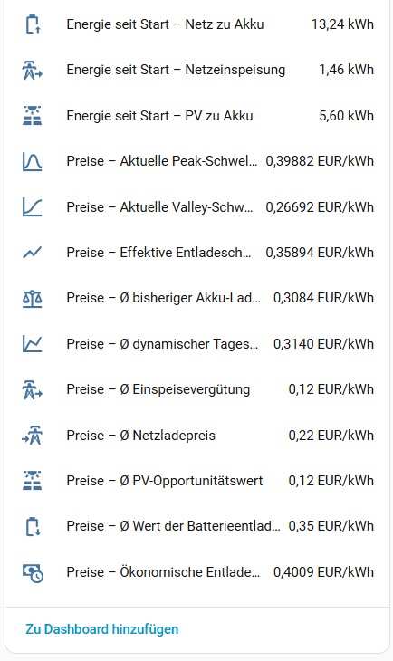
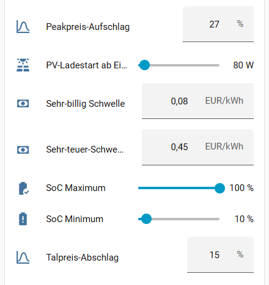
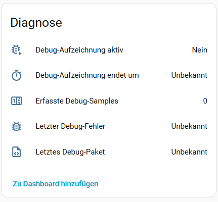
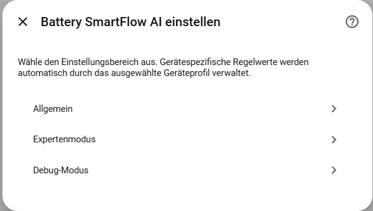
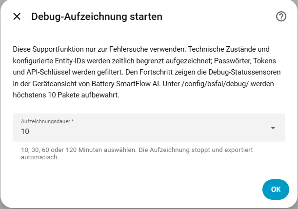

# 📘 Battery SmartFlow AI – User Guide

**Language:** [Deutsch](anleitung.md) | English

> Applies to Battery SmartFlow AI V4.6.0 and later
> Last content update: August 25, 2026

**Intelligent, economical and stable control for Zendure SolarFlow systems in Home Assistant**

---

## Table of Contents

* [Chapter 1 – What does Battery SmartFlow AI do?](#chapter-1--what-does-battery-smartflow-ai-do)
* [Chapter 2 – Mandatory Requirements](#chapter-2--mandatory-requirements)
* [Chapter 3 – Installation](#chapter-3--installation)
* [Chapter 4 – Configuring the Integration](#chapter-4--configuring-the-integration)
* [Chapter 5 – Operating Modes & How They Work](#chapter-5--operating-modes--how-they-work)
* [Chapter 6 – Sensors & Controls](#chapter-6--sensors--controls)
* [Chapter 7 – Editing Settings](#chapter-7--editing-settings)
* [Chapter 8 – Technical Background](#chapter-8--technical-background)
* [Chapter 9 – FAQ & Typical Problems](#chapter-9--faq--typical-problems)
* [Chapter 10 – Best Practices](#chapter-10--best-practices--recommended-settings)
* [Appendix 1 - Device Profile Parameters](#appendix-1--device-profile-parameters)
* [Appendix 2 – Important Diagnostic Values for Support](#appendix-2--important-diagnostic-values-for-support)

---

# Chapter 1 – What does Battery SmartFlow AI do?

**Battery SmartFlow AI** is a Home Assistant integration for intelligent control of Zendure SolarFlow battery systems.

It connects batteries, photovoltaics, home consumption and - optionally - dynamic electricity prices, PV forecasts, additional battery systems and off-grid consumers into a coordinated overall system.

Based on this information, the integration automatically decides:

* when to charge
* when to discharge
* how much power to use for charging or discharging
* when idling is preferable
* when protective functions have priority
* when technical holding states make sense
* when an off-grid socket must be considered in diagnostics

---

## 🎯 Integration goal

Battery SmartFlow AI doesn't just try to charge or discharge as often as possible.

The goal is a balanced interaction of:

| Target | Meaning |
| --------------------- | ---------------------------------------------- |
| 💶 Economy | Use low prices, avoid expensive prices |
| ☀️ PV usage | Store PV surplus efficiently |
| 🏠 Household load coverage | Reduce grid import |
| 🔋 Battery protection | Respect SoC and cell-voltage protection |
| ⚙️ Control stability | Avoid unnecessary INPUT/OUTPUT chatter |
| 🔍 Transparency | Make decisions understandable |

> [!TIP]
> The best result is not always every single measurement exactly at `0 W`.
> V4.3.0 regulates close to the economic target point; depending on the device profile and
> feed-in tariff, this may be slightly on either the grid-import or grid-export side.

---

## 🧠 Basic principle

Battery SmartFlow AI separates two levels:

### 1. Strategic decision

The strategic level decides:

> **What should happen in principle?**

Examples:

* charge from PV surplus
* household load coverage
* Use the favorable price window for charging
* Use high-price windows for discharging
* Trigger emergency charging
* Observe off-grid load separately from the grid control path
* do nothing because of protection conditions

### 2. Technical power control

The technical level decides:

> **How is this decision implemented reliably on the device?**

Examples:

* Can you really switch from INPUT to OUTPUT now?
* Is export stable enough for PV charging?
* Does OUTPUT need to be slowly turned down after a load drop?
* Should a command be rewritten or can it be skipped?
* How much may power increase or decrease per control cycle?

This separation forms the binding control path for all installations in V4.3.0.

---

## ✨ Most important new features in V4.3.0

Battery SmartFlow AI has evolved significantly since the early versions.

Important innovations compared to V4.2.8:

* 🧠 unified, season-independent automatic control
* ☀️ own self-sufficiency mode instead of the previous summer mode
* 🔒 AC charge commitment for planned and economically started grid charging
* 🎯 more precise grid-controlled charging and discharging control close to 0 W
* ⚖️ Economically justified slight grid export instead of unnecessary grid import
* 💶 feed-in tariff as a cost basis for PV charging
* 🔀 Weighted mixed price with simultaneous PV and grid charging
* 🔍 Separate strategic, visible and technical diagnostic states
* 🧩 new profiles for SolarFlow 3000/4000 Mix AC+ and 4000 Mix Pro
* ⚡ Power limits up to 4000 W with a device-specific safety cap

---

## 🧭 In short

Battery SmartFlow AI is not intended to switch as much as possible, but rather:

> **First understand, then decide, then regulate technically.**

---

# Chapter 2 – Mandatory Requirements

In order for Battery SmartFlow AI to work correctly and stably, certain settings must be observed.

The integration takes full control of the Zendure system.
Parallel or conflicting controls lead to instability.

> [!IMPORTANT]
> If the system does not work as expected, the prerequisites in this chapter should first be checked.
> Many errors arise from parallel controls outside of Battery SmartFlow AI.

---

## 1️⃣ Zendure Original app

The following points must be checked in the official Zendure app:

* Set charging power to maximum
* Set discharging power to maximum
* Disable HEMS
* do not activate time-controlled charging/discharging plans
* do not activate any external power limitation

---

### ⚠ Check hardware list

In the Zendure app, the hardware configuration should be as clean as possible.

Additional control or measuring components are particularly critical, as they themselves can influence the control behavior.

The following can be problematic:

* Shelly Pro 3EM directly in Zendure
* external smart meters/meters
* Zendure's own measuring sensors with HEMS control
* other power or grid sensors that control Zendure directly
* active app automations

Battery SmartFlow AI requires the cleanest possible hardware configuration without parallel control instances.

---

## 2️⃣ Zendure Home Assistant integration

The following settings are required:

* Energy export: **Allowed**
* the P1 sensor may be selected during initial Z-HA setup
* afterwards, set Z-HA Manager operating mode to **OFF** so Z-HA does not
  regulate in parallel with BSFAI
* no parallel automations that change AC mode or power limits


The screenshot uses a German interface; `Betriebsmodus: Aus` means `Operating
mode: Off`.

Incorrect settings can lead to:

* Discharge terminations
* blocked AC modes
* Switch between INPUT/OUTPUT
* wrong conditions
* Misinterpretations
* greatly increased number of switching operations

---

## 3️⃣ Electricity price integration

Electricity price integration is optional but required for economical pricing logic.

Basically, all sensors that provide a current electricity price and optionally price forecast data are supported.

Typical sources:

* Tibber
* EPEX
* Octopus Energy
* Octopus Energy Forecast API
* own template sensors

Without electricity price it is still possible:

* PV surplus charging
* household load coverage in self-sufficiency mode
* manual control
* Protection logic
* Off-grid detection
* diagnosis

Without electricity price, price-based charging and discharging decisions are not available or are only available to a limited extent.

---

## 4️⃣ PV forecast

PV forecasts are optional.

If appropriate predictive sensors are present, Battery SmartFlow AI can use them for better charge planning.

Typical sensors:

* PV forecast today
* PV forecast tomorrow

The prognosis is not treated as the sole truth. It is an additional planning input.

Battery SmartFlow AI further takes into account:

* real current PV power
* grid import
* grid export
* household load
* SoC
* Price window
* learned consumption data

If no forecast is configured, the integration will continue to work.

---

## 🛡️ Important

Battery SmartFlow AI is not a replacement for the manufacturer's protective features.

The integration implements decisions in Home Assistant. The actual hardware, BMS and Zendure firmware retain their own protection mechanisms.

Nevertheless, all limit values should be set sensibly.

---

# Chapter 3 – Installation

Battery SmartFlow AI is installed via HACS.

---

## 🚀 Quick installation via HACS

The repository can be opened directly in HACS using the following button:

[](https://my.home-assistant.io/redirect/hacs_repository/?owner=PalmManiac&repository=battery-smartflow-ai&category=integration)

Thereafter:

1. Add repository
2. Install integration
3. Restart Home Assistant
4. Add integration across devices & services

---

## 🔧 Manual installation via HACS

If the direct link is not used:

1. Open HACS
2. ⋮ → **Custom Repositories**
3. Insert repository URL:

```text
https://github.com/PalmManiac/battery-smartflow-ai
```

4. Type: Select **Integration**
5. Confirm add
6. Search for **Battery SmartFlow AI** in HACS
7. Install

---

## 🔄 Restart required

After installation, Home Assistant must be restarted.

Only after the restart is the integration under:

```text
Settings → Devices & services → Add integration
```

available.

---

## Note on the old name

Battery SmartFlow AI was previously called **Zendure SmartFlow AI**.

If a very old version was installed, old names or old integration entries may still be visible in Home Assistant.

What is important is:

* the new repository name is `battery-smartflow-ai`
* the domain is `battery_smartflow_ai`
* old manual installations should be removed cleanly
* After renaming, a restart makes sense

If Home Assistant still shows an old display name even though the new integration is loaded correctly, this may be caused by old saved integration entries.

---

# Chapter 4 – Configuring the Integration

After installation, Battery SmartFlow AI is set up via Home Assistant:

```text
Settings → Devices & services → Add integration → Battery SmartFlow AI
```

An example of the integration entry:


> [!NOTE]
> This screenshot shows the integration entry in Home Assistant.
> The actual configuration takes place via the setup dialog and the later options/profile area.

---

## 4.1 Device profile & basic data


---

### Device profile

The appropriate profile for the Zendure model used is selected here.

The profile defines:

* Dynamics of power control
* Security limits
* Control parameters
* Hardware limits
* Low SoC behavior
* Off-grid capabilities
* Mode switch behavior

Currently supported or planned profiles:

| Profile | Typical use |
| ------------------------- | ------------------------------------------------------ |
| SolarFlow 800 Pro | 800 W system with its own stability profile |
| SolarFlow 800 Pro 2 | 800 W system with particularly conservative tuning |
| SolarFlow 1600 AC+ | 1600W AC System |
| SolarFlow 2400 AC | 2400W class pure AC coupled storage |
| SolarFlow 2400 AC+ | AC+ variant of the 2400 W class |
| SolarFlow 2400 Pro | 2400 Pro System |
| SolarFlow 3000 Mix AC+ | AC coupled storage, 3000W AC / 3680W Off-Grid |
| SolarFlow 4000 Mix AC+ | AC coupled storage, 4000W AC / 3680W Off-Grid |
| SolarFlow 4000 Mix Pro | AC coupled storage, 4000W AC / 3680W Off-Grid |
| Hyper 2000 | Hyper System |
| HUB 2000 | HUB system |

> [!IMPORTANT]
> Always choose the profile that comes closest to your system.
> An incorrect profile can lead to control that is too aggressive or too sluggish.

The three mix models are purely AC-coupled battery storage without direct
PV connection. They therefore use the neutral rule vote of the
SF2400AC, each with their own confirmed performance limits.

> [!WARNING]
> Practical use is currently possible with the new 3000 and 4000 models
> may still be limited by a firmware problem. A token connection to
> Z-HA can come about without the device subsequently having current data
> delivers. Entities created via MQTT are not a reliable alternative,
> because this way is no longer supported by Zendure and is not reliable
> is updated.

---

### Battery SoC sensor

Sensor with the current charge level of the battery in percent.

* Unit: %
* Mandatory field
* Basis of all decisions

No control is possible without a valid SoC.

The SoC is used for:

* SoC minimum
* SoC maximum
* emergency charging
* Discharge release
* Learning planning
* Protection decisions
* available battery energy

---

### SoC limit status

Optional sensor from Zendure integration.

It reports active BMS limits such as:

* Charging lock
* Discharge lock

Battery SmartFlow AI respects these hardware limitations.

Typical conditions:

| Condition | Meaning |
| ------------------- | ---------------------------------------- |
| no limit active | Charging and discharging are generally possible |
| upper limit active | Charging is blocked |
| lower limit active | Discharging is blocked |
| not configured | Sensor was not selected |

---

### Capacity per battery pack

Indication of the usable capacity of an individual battery pack in kWh.

This value is crucial for:

* kWh delta calculation
* Charging duration estimate
* Profit calculation
* Learning planning
* Planning before price peaks
* available battery energy

If several battery packs are installed, this value is multiplied by the number of packs.

Example:

```text
2 battery packs × 2.88 kWh = 5.76 kWh
```

> [!WARNING]
> Incorrect capacity information leads to incorrect economic results and inaccurate charge planning.

---

### Battery power sensor

The battery power sensor is important for balancing.

Recommended sign:

| Condition | Value |
| ---------------- | ------- |
| Battery discharged | positive |
| Battery charging | negative |

This sensor is used for:

* Detection of real charging
* Detection of real discharging
* household load calculation
* Learning planning
* charging price calculation
* Profit/savings calculation

If the sign is wrong, calculations and diagnoses can become implausible.

---

### Installed PV power

The theoretically installed module output of the system is stated here in Wp.

The value supports the relative classification of the current PV output and the
Automatic context. It does not switch to a separate summer or winter strategy.

---

### PV power sensor

Sensor with current PV power in watts.

Used for:

* Excess detection
* dynamic control
* PV weighting of the automatic system
* Learning planning context
* PV household load coverage
* Off-grid context
* Forecast comparison

---

### Native battery-system PV power sensor (optional)

Select this sensor only when it reports the PV power connected directly to the
battery system, for example the combined solar input power of an SF2400Pro.
During an active AC charge, Battery SmartFlow AI reserves this power inside the
configured maximum charge limit and requests only the remaining power from the
controllable AC input. This prevents grid charging from displacing free native
PV at the device's physical charge limit.

Do not select the total house PV sensor here. If the sensor is not configured
or is temporarily unavailable, the previous compatible charging behaviour is
retained.

---

### Use without a PV system

If there is no PV system, a simple template sensor that permanently supplies **0 W** can be used.

```yaml
template:
  - sensor:
      - name: "Dummy PV Power"
        unit_of_measurement: "W"
        state: "0"
```

---

## 4.2 Price & AC


---

### Price history

Price history is optional, but very important for planning and dynamic pricing logic.

It contains future price values, e.g. B. for the next few hours or the next day.

Battery SmartFlow AI uses this data to:

* Valley detection
* Peak detection
* planned charging
* Learning planning
* economic discharging
* Price window evaluation

---

### Current electricity price

The current electricity price is used for decisions in the current moment.

Examples:

* Is the current price very cheap?
* Is the current price high enough for discharging?
* Is it worth discharging compared to the saved charging price?
* Does emergency charging or planned charging make economic sense?

---

### Feed-in tariff

The optional feed-in tariff is entered in full currency per kWh.

Example:

```text
0,122 €/kWh = 12,2 ct/kWh
```

It is used for two economic assessments:

* Optional grid charging should only replace existing PV charging if the
Mains electricity is cheaper than the lost feed-in tariff.
* With PV charging, the compensation is calculated as lost revenue in the average
Charging price of the battery is included.

Without a registered feed-in tariff, PV charging will continue with `0,00 €/kWh`
evaluated.

---

### Zendure AC operating mode

AC mode is the central switching of the Zendure system.

Typically there are:

* INPUT
* OUTPUT

INPUT usually means:

* Battery charge
* AC charging path active

OUTPUT usually means:

* Battery discharge
* household load coverage
* technical supply path

Battery SmartFlow AI sets this mode automatically.

---

### Zendure charging power

The charging powers entity is a Number entity.

Battery SmartFlow AI sets the desired charging power in watts.

---

### Zendure discharging power

The discharging powers entity is also a Number entity.

Battery SmartFlow AI sets the desired discharging power in watts.

---

## 4.3 Grid measurement


Grid measurement is crucial for good control.

Battery SmartFlow AI supports three variants.

---

### No grid sensor

In this mode, Battery SmartFlow AI can only work to a limited extent.

Above all, the following are possible:

* SoC-based decisions
* Pricing logic
* emergency charging
* manual control

The following are not optimally possible:

* accurate household load coverage
* accurate PV excess detection
* stable 0W control
* precise grid-controlled power regulation

---

### One sensor (+ / −)

A combined grid sensor delivers:

| Value | Meaning |
| ------- | ----------- |
| positive | grid import |
| negative | grid export |

Example:

```text
+250 W = grid import
-400 W = Netzeinspeisung
```

Battery SmartFlow AI calculates internal reference and grid export from this.

---

### Two sensors

Split mode with two separate sensors is recommended:

* grid import
* grid export

Both sensors deliver positive values.

Example:

```text
Grid import: 250 W
Netzeinspeisung: 0 W
```

or:

```text
Grid import: 0 W
Netzeinspeisung: 400 W
```

This variant is the clearest and particularly suitable for control.

---

## 4.4 Grid sensors in split mode


In split mode, two sensors must be selected:

* grid import
* grid export

> [!WARNING]
> Make sure that the sensors are not mixed up.
> Swapped sensors lead to wrong decisions.

Typical consequences of swapped sensors:

* Charging at grid import
* Discharging at grid export
* incorrect household load
* implausible diagnostic values
* unstable control

---

## 4.5 Additional battery detection

Battery SmartFlow AI can optionally monitor another battery system.

There are two optional sensors for this:

* Additional battery charging power
* Additional battery discharging power

This function is important if there are several battery systems in the house, but they are not yet controlled in a coordinated manner.

---

### Additional battery is charging

If another battery is currently charging, Battery SmartFlow AI can block its own discharging.

Reason:

> One battery should not indirectly charge the other battery.

Example:

```text
Additional battery is charging at 500 W
Battery SmartFlow AI would otherwise discharge
→ Discharging is blocked
```

---

### Additional battery is discharging

If another battery is discharging, Battery SmartFlow AI can block its own charging.

Reason:

> The discharging of the other battery must not be incorrectly interpreted as a PV surplus.

Example:

```text
Additional battery is discharging at 400 W
Netzsensor zeigt dadurch scheinbar weniger Bezug
Battery SmartFlow AI might otherwise start PV charging
→ Laden wird blockiert
```

---

### Aim of additional battery detection

The function prevents:

* battery-to-battery charging
* incorrect PV excess detection
* unnecessary charge/discharge cycles
* Conflicts between separate battery systems

> [!NOTE]
> This does not mean real coordinated multi-battery control.
> This is intended for a later larger version.

---

## 4.6 Off-grid/island socket

Some Zendure systems have an off-grid or island socket.

Battery SmartFlow AI can optionally evaluate this.

There are two optional configuration fields:

* Off-grid power / island socket
* Off-grid mode



---

### Off-grid power

The off-grid power sensor reports the power at the island socket.

For confirmed 2400 Zendure systems:

* Positive values mean active load on the island socket

Example:

```text
Off-grid power: 520 W
→ a load of approximately 520 W is connected to the off-grid socket
```

Battery SmartFlow AI uses this information for separate diagnostics.
A detected off-grid load does not generally block an otherwise valid charging
or discharging strategy.

---

### Off-grid mode

Off-grid mode is an optional select sensor.

Typical internal states:

| Condition | Meaning |
| -------- | --------------------------- |
| `off` | Off-grid off |
| `normal` | Normal operation |
| `eco` | economical off-grid mode |

Battery SmartFlow AI reads only in this mode.

> [!IMPORTANT]
> Battery SmartFlow AI does not set or change off-grid mode.
> Control remains with Zendure App, ZHA or the Zendure integration used.

---

### Behavior with active off-grid load

An active off-grid load is observed regardless of the AC strategy:

```text
offgrid_load_observed
```

That means:

* Off-grid load detected
* the valid charging or discharging strategy remains in effect
* Small and permanent island loads do not block AC charging across the board
* SoC and cell protection remain active
* emergency charging and manual specifications retain their priority

---

### What affects off-grid?

Off-grid power is recorded as a separate device path for diagnostic purposes.
It is not added to household load in the grid-control path and does not override
valid candidates for:

* Price-based charging
* Valley charging
* Learning planning
* planned grid charging
* very-cheap-charging

---

### Limitation

Battery SmartFlow AI does not change the device's off-grid mode. Which
The power that the island socket actually provides remains dependent on Zendure.
Firmware, device limits and device configuration dependent.

---

## Important note about the Zendure app

In order for Battery SmartFlow AI to work reliably, no parallel automations should be active in the Zendure app.

The following are particularly critical:

* automatic HEMS control
* own charging/discharging plans
* dynamic power control outside BSFAI
* a Z-HA Manager operating mode other than **OFF**; selecting the P1 sensor
  during initial Z-HA setup is allowed
* parallel home assistant automations on the same entities

---

# Chapter 5 – Operating Modes & How They Work

Battery SmartFlow AI offers several operating modes.

The modes determine which strategic decisions are preferred.

---

## 5.1 Operating modes

---

## 🔹 Automatic

Automatic mode is the recommended default mode.

It combines:

* PV power
* household load
* SoC
* dynamic prices
* PV forecast
* learned planning
* current PV, price, reserve and forecast context
* Protection logic

Automatic mode uses one unified strategy throughout the year. It no longer
switches between separate summer and winter logic. Instead, it evaluates whether
the current situation is dominated by PV, price, reserve or a balanced context.
The actual charging or discharging decision remains with the Decision Engine.

Typical decisions:

* charge from PV surplus
* discharge at high load
* charge at favorable prices
* discharge at high prices
* If the PV forecast is weak, recharge in a timely manner
* do nothing if the battery is sufficient
* Respect protection conditions

Strategic grid charging based on planning, learned planning, valley prices,
very-cheap prices or reserve requirements is permitted only in Automatic mode.

---

## 🔹 Self-sufficiency mode

The self-sufficiency mode is designed for self-sufficiency and household load coverage.

Typical goals:

* Make optimal use of existing PV
* household load coverage
* reduce unnecessary grid import
* charge from PV surplus
* battery does not need to be unnecessarily charged from the mains

In self-sufficiency mode, discharging for household load coverage is particularly important.

Normal strategic grid charging will not start in this mode. At
Changing from Automatic to Self-sufficiency mode ends an active AC charge commitment.
PV surplus charging, household load coverage and protection functions remain active.

If SoC minimum or discharge re-enable is active, discharging can be blocked. In such cases, the protection logic takes precedence.

---

## 🔹 Manual

In manual mode, Battery SmartFlow AI does not intervene strategically.

The user can choose:

* Standby
* Charging
* Discharging
* constant discharging

Manual mode is useful for:

* Tests
* diagnosis
* Special cases
* manual interventions
* Comparison with automatic control

Protective mechanisms still remain effective.

---

## 5.2 Adaptive peak detection

Adaptive peak detection detects expensive price windows.

Not only a fixed price is taken into account, but also the daily price level.

The peak price markup determines how many percent above the daily average a
price must be before it is considered a peak.

Formula:

```text
Peak threshold = max(
  Average price × (1 + peak price markup / 100),
  Average price + €0.03
)
```

Default value:

```text
35%
```

| Peak price markup | Effect |
| ----------------- | ------------------------------- |
| lower | detects more peaks |
| higher | only detects strong price spikes |

---

## 5.3 Decision reason

The **decision reason** sensor explains why Battery SmartFlow AI just made a decision.

Examples:

```text
pv_surplus_charge
summer_cover_deficit
charge_commit_active
price_based_discharge
adaptive_peak_discharge
planning_forecast_poor
learned_charge_window_wait
soc_min_resume_block
cell_voltage_cutoff_block
```

> [!TIP]
> If the system does not do what is expected, the decision reason should be checked first.
> If this visible value is not sufficient, start a short debug recording. The
> JSON package contains strategy, technical permissions and the device command.

---

## 5.4 Very expensive and very cheap thresholds

Battery SmartFlow AI can work with custom price limits.

### Very expensive threshold

This threshold can be used to mark particularly expensive price windows.

It can influence discharging decisions.

### Very cheap threshold

This threshold can be used to detect very cheap or even negative electricity prices.

If prices are very cheap, a maximum charge can make sense.

The threshold can also take negative values if the tariff delivers negative prices.

---

## 5.5 AC charge commitment

A planned or economically initiated grid charge receives an
**AC charge commitment**. It stores, among other things:

* Trigger and type of charging
* Target SoC
* requested charging power
* Start, validity and, if applicable, deadline
* permissible price range for learning planning

The charge commitment prevents a sensible charging process from being cancelled
immediately by brief changes in price, PV power or grid power. Depending on the
plan, it may wait first, charge actively, or force charging at the latest
necessary time so that the required energy is available by the deadline.

A waiting charge commitment does not reserve the system completely. PV charging,
economic discharging, technical household-load passthrough and emergency charging
may still take priority.

Typical reasons for termination are:

* Target SoC or maximum SoC reached
* Planning deadline expired
* The battery no longer accepts any relevant charging power near the target
* economic conflict in reserve charging
* Protection or sensor data error
* Switch to self-sufficiency or manual

PV power during active grid charging does not terminate the charge commitment. It
reduces the required grid share and therefore improves the blended charging price.

---

## 5.6 Grid-controlled power regulation

Battery SmartFlow AI doesn't just try to charge or discharge at full power.

Instead, the performance is based on the network situation.

Examples:

* With grid import, discharging can be increased
* With grid export, charging power can be increased
* When the load drops, OUTPUT is not immediately hard terminated
* When there are clouds, INPUT is not immediately changed frantically
* Small deviations within a dead zone are initially calmed down
* The remaining grid import is finely adjusted when discharging is active
* PV charging reduces early, before unnecessary grid import occurs

The control combines dead zone, step limitation, network course and holding states.
This allows it to work closer to the target point without causing INPUT/OUTPUT chatter
generate.

---

## 5.7 Unified V4.3 control path

Since V4.3.0, the following technical control chain is mandatory for all installations:

```text
AutomaticStrategy context
→ Decision Engine
→ StrategyDecision
→ visible state
→ StrategyIntent
→ ModeArbiter
→ RegulationPowerController
→ DeviceCommand
→ Home Assistant / Zendure
```

These terms describe internal stages of the control path. They are not separate
Home Assistant sensors; their details are available in the debug package when
needed.

AutomaticStrategy does not create a second decision engine. It evaluates the
context and provides strategic approvals. The Decision Engine collects eligible
candidates and chooses the actual action by priority.

### Decision Engine

Decides strategically what should happen.

Examples:

* Charging
* Discharging
* Wait
* Emergency charge
* Consider off-grid context

### StrategyDecision and visible state

The strategic result is given a clear status, priority and
a calm, user-understandable visible state. The original one
decision reason remains separately as the source reason.

### StrategyIntent

Translates the strategic decision into a technical intent.

Examples:

```text
pv_charge
planned_charge
cover_deficit
peak_discharge
arbitrage_discharge
emergency_charge
manual_charge
passthrough
```

### ModeArbiter

Decides whether the desired mode is now technically permitted.

It takes into account:

* current grid history
* stable import and export cycles
* Mode change blackout times
* active hold states
* Additional battery charging or discharging
* SoC and cell protection

### RegulationPowerController

Calculates the specific power.

It takes into account:

* Target grid import
* Dead zone
* controller gain
* maximum step size
* previous power
* Profile limits
* short- and medium-term grid development
* economic target for slight grid import or slight grid export

### DeviceCommand

Generates the final command.

It decides:

* AC mode
* Input limit
* Output limit
* whether a value needs to be written
* whether a write process can be skipped

---

## 5.8 Economic calculation

Battery SmartFlow AI can calculate whether discharging makes economic sense.

For this purpose, a weighted average charging price is determined.

Example:

```text
Battery was charged inexpensively at €0.18/kWh
aktueller Preis liegt bei 0,32 €/kWh
→ discharging may be economically beneficial
```

The profit margin determines how large the price difference should be at least.

---

### Important for PV charging

PV charging is not automatically economically free. If one
feed-in tariff is configured, the charging price of the PV share corresponds to this
lost feed-in revenue.

Example:

```text
Feed-in tariff: €0.122/kWh
PV-only charging:    €0.122/kWh storage cost
```

With simultaneous PV and grid charging, both shares with their respective
Prices weighted. Negative network prices remain. The charge origin
is cached during real charging, so that there is also a delay
reported SoC increase can still be assigned to the correct cost basis.

Without a configured feed-in tariff, the PV share remains at `0,00 €/kWh`.

### Economic target point of control

For PV charging with a stored feed-in tariff, the control prefers one
small grid export versus unintentional grid import. This is the case with discharging
Light feed-in alignment is only economically permissible if the value of the
stored energy including safety distance below
feed-in tariff lies. Strategic grid, emergency and manual charging will be available
not influenced by it.

---

### Technical support modes

Some states are technically sensible, but no economic discharging.

Example:

* PV household load passthrough

These are not counted as economic price discharge.

---

## 5.9 Transparency sensors

Battery SmartFlow AI provides many sensors to make decisions understandable.

The following are particularly helpful:

* decision reason
* AI status
* AI recommendation
* Engine status
* current peak and valley thresholds
* effective discharge threshold
* economic discharge threshold
* Learning planning status
* planned charge start, deadline and required charging energy
* the five lightweight debug-recording status values

Deep strategy, charge-commitment, off-grid and regulation details have
deliberately not been created as permanently active diagnostic entities since
V4.4. When needed, a time-limited debug recording captures this information in
a JSON package. This keeps the normal device view understandable and avoids
filling Home Assistant Recorder with technical detail values.

---

# Chapter 6 – Sensors & Controls

This chapter explains the most important sensors and controls.

---

## Finding your way around the device view from V4.6.0



Battery SmartFlow AI splits its entities between two clearly arranged devices.
They are still part of **one integration and one shared control system**:

| Device | What does it contain? | When should I open it? |
| ------ | --------------------- | ---------------------- |
| **Battery SmartFlow AI – Control & Planning** | Operating mode, power control, charge planning, protection limits and technical diagnostic values | When you want to change operation or understand a control decision |
| **Battery SmartFlow AI – Economics & Prices** | Current prices, price thresholds, energy flows, costs, revenue and economic efficiency | When you want to configure prices or assess the financial result |

The second line below each name is only a short device description. Home
Assistant also shows the assigned area for the control device. The virtual
economics device has no physical location. Entity counts can differ slightly
from the screenshot depending on configuration and Home Assistant version.

> **For new users:** In everyday use, the **Control & Planning** device is
> usually enough. Open **Economics & Prices** when you want to know why BSFAI
> considers a price cheap or expensive and whether charging and discharging have
> paid off so far.

The screenshots use a German Home Assistant interface. The device layout and
values are the same when Home Assistant is set to another supported language.

---

# 6.1 Status & Economic Sensors

The economics and price sensors are grouped in the virtual **Battery SmartFlow
AI – Economics & Prices** device.





Entity names follow a consistent pattern: the text before the dash identifies
the group; the text after it identifies the specific value.

| Group | Plain-language meaning |
| ----- | ---------------------- |
| **Current** | Values currently used for the economic assessment |
| **Balance today** | Costs, revenue and benefits accumulated since midnight |
| **Balance since start** | Persistent economic totals since BSFAI accounting began |
| **Energy today** | Energy measured today, grouped by flow direction |
| **Energy since start** | Persistent energy totals, grouped by flow direction |
| **Prices** | Calculated average prices and the charge/discharge thresholds currently in effect |

### Reading the flow direction

Names such as **Grid to battery**, **PV to battery** and **Battery to home** are
always read from left to right. For example, **Energy today – Grid to battery**
is the energy charged from the public grid into the battery today. **Battery to
grid** is battery energy deliberately exported to the grid.

### Reading the balance

* **Grid charging cost** is the cost of energy charged from the grid into the
  battery.
* **PV opportunity cost** is not an amount on your electricity bill. It is the
  feed-in revenue you gave up by storing PV energy instead of exporting it.
* **Avoided grid cost** values energy supplied from the battery to the home,
  avoiding more expensive grid consumption.
* **Feed-in revenue** values exported energy using the configured feed-in tariff.
* **Battery benefit** is BSFAI's calculated economic benefit of the battery. A
  single daily value can temporarily be negative when energy is charged today
  but discharged later. The **since start** balance is therefore more meaningful
  for the overall result.

### Understanding prices and thresholds

The displayed thresholds are **calculated decision limits**, not additional
costs:

* **Current peak threshold:** BSFAI detects a costly dynamic price peak at or
  above this price.
* **Current valley threshold:** BSFAI detects an inexpensive valley below this
  value.
* **Effective discharge threshold:** The price boundary actually used after all
  active rules have been applied.
* **Economic discharge threshold:** The minimum price at which discharging pays
  off after the valued charging price and profit margin are considered.
* **Average battery charging price:** Estimated average cost of the energy
  currently stored in the battery.
* **Average battery discharge value:** Average economic value of the battery
  energy delivered so far.

`Unknown` immediately after startup does not automatically indicate a fault. A
value may need source data or sufficient recorded charging/discharging energy
before it can be calculated. If an important value remains unknown, first check
its configured source entities.

---

## System status

Shows the general status of the integration.

Typical values:

| Condition | Meaning |
| -------------------- | ---------------------------------------------- |
| OK | Integration works normally |
| Initialization | System starts |
| Sensor data invalid | a mandatory sensor does not provide a valid value |
| Price data invalid | Price source unusable |

---

## AI status

Shows the current main state.

Examples:

* Readiness
* Charging
* Discharging
* emergency charging
* Manual mode

---

## AI recommendation

Shows the current recommendation of the integration.

Examples:

* Charging
* Discharging
* No action
* emergency charging

---

## Household load

The household load is calculated from the grid, PV and battery.

It is the estimated real burden of the household.

A correct household load is important for:

* Self-sufficiency mode
* discharging
* Learning planning
* diagnosis
* Profile analysis

---

## Average battery charging price

The average charging price is a weighted value.

It describes the approximate price at which the currently stored energy was charged.

It is used for:

* economic discharging
* Profit calculation
* Price comparison

When it comes to grid charging, the current grid price is taken into account. With PV charging there is one
configured feed-in tariff is used as lost revenue. With mixed
charging results in a weighted mixed price. The average value is with the
updated with the next detected energy increase.

---

## Applied charging price

This sensor shows the price used to value the current charging share. The
internally determined charging source, PV/grid shares and any mixed-price state
are not created as separate sensors. They are available in the debug package
when required.

The **applied charging price** can already be visible during charging.
The **Ø charging price battery**, on the other hand, is only activated when a SoC or
Energy increase permanently weighted.

---

## Economic efficiency since start

This sensor does not measure the technical efficiency of the battery and
inverter. The device-level Zendure-HA sensor remains responsible for that value.

Instead, BSFAI compares the economic value of discharged battery energy since
the start of accounting with the valued charging input:

```text
Economic efficiency =
  Value of battery discharge
  ÷ (grid charging cost + PV opportunity cost)
  × 100
```

* below 100%: The valued charging input has not yet been fully recovered.
* 100%: The valued charging input is exactly recovered.
* above 100%: The battery has generated additional economic value.

The sensor becomes available only after at least 0.1 kWh of both charging and
discharging have been recorded since the start. A non-positive charging input,
for example exclusively free or negatively priced charging energy, has no finite
cost-recovery ratio and is therefore not represented by an invented percentage.
The since-start value is more meaningful than a daily value because charging and
discharging can span midnight.

---

## Ø Daily price

The average daily price is calculated from the available price forecast data.

It serves as the basis for:

* Peak detection
* Valley detection
* relative price evaluation

---

# 6.2 Peak & Transparency Sensors


---

## Adaptive peak detected

Shows whether a dynamically detected price peak is currently active.

---

## Current peak threshold

Shows the price value from which the current period is considered a peak.

---

## Current valley threshold

Shows the price value below which a price window is considered cheap.

---

## Current electricity price

Shows the currently valid electricity price.

---

## Engine status

Shows whether the decision logic can fully work.

Examples:

* System normal
* No pricing data available
* No current electricity price
* Invalid sensor data

---

## Decision reason

The most important explanation sensor.

It shows the exact reason for the current decision.

Examples:

* charge from PV surplus
* household load coverage
* AC charge commitment active
* Price-based discharging
* Additional battery charging: discharging blocked
* Island socket active: load observed
* cell-voltage protection active

---

## Technical decision details

Strategy state, technical permissions, AC charge commitment, charging-source
allocation and the final device command still exist as internal parts of the
control system. However, they are **no longer Home Assistant sensors**.

For normal operation, **AI status**, **AI recommendation** and **Decision
reason** provide the relevant explanation. If they do not explain a particular
behavior, start debug mode shortly before the situation occurs. The exported
JSON package contains the complete decision path for support and troubleshooting.

---

## Active device profile

Shows the device profile used.

This value is very important for support requests.

---

## Control context

Briefly shows which soft weighting context currently applies:

* **PV** – the current PV situation receives more weight
* **Price** – price windows and battery reserve receive more weight
* **Manual** – manual operation is active

> [!NOTE]
> The control context is neither a selectable operating mode nor a detected
> season. **Price** can therefore appear during summer when current PV
> conditions are weak. The selectable modes remain Automatic, Autarky and
> Manual.

---

## Savings/profit

Shows the calculated savings or profit through price arbitrage.

---

# 6.3 Learning planning sensors

The normal device view keeps only the most important learning-planning results.
They show whether planning is ready, when it intends to charge and how much
energy is required.

---

## Charge planning: learning status

Shows whether there is enough learning data.

Typical values:

| Condition | Meaning |
| ------------------------ | ------------------------------------------- |
| Not started yet | no data has been collected yet |
| Data is collected | Learning model builds history |
| Not enough learning data | Conditions not yet met |
| Ready | Learning planning can be used |
| Active | Learning planning currently controls a charging window |

---

## Charge planning: mode

Shows the current learning planning mode.

Examples:

* Disabled
* Data is collected
* Classic planning
* Learning planning ready
* Learning planning is waiting for charging window
* Learning planning active

---

## Charge planning: planned charging start

Shows the optimally calculated start time for the planned charging.

---

## Charge planning: deadline

Shows the time by which the battery should be sufficiently charged.

---

## Charge planning: required charging energy

Shows how much energy is expected to need to be recharged.

---

## Charge planning: window size

Shows the length of the planned charging window.

---

## Additional learning-planning details

History days, data coverage, expected consumption, available battery energy,
reserve margin, forecast adjustment and blocking reason are still calculated
internally. Since V4.4, however, they are no longer created as permanent
diagnostic sensors. These details are available in the JSON package from a
targeted debug recording.

---

# 6.4 Off-grid source data

The optionally configured off-grid entities come from the Zendure system and
are read by BSFAI as **source data**. BSFAI no longer creates separate off-grid
status or diagnostic sensors for them.

During normal operation, the response is visible through **AI status** and
**Decision reason**. For detailed analysis, the time-limited debug package
includes the read off-grid power, mode, detected load and internal control
reason.

> [!NOTE]
> Battery SmartFlow AI does not switch the island socket or change its mode. It
> only considers the configured source data in its own charging and discharging
> decisions.

---

# 6.5 Cell voltage sensors

The cell-voltage protection is optional and belongs to the expert area.

It can be used if there are suitable sensors for the lowest cell voltage per battery pack.

---

## Global lowest cell voltage

Shows the lowest cell voltage across all configured packs.

---

## Cell voltage status

Possible states:

* Disabled
* Normal
* Warning area active
* Discharge lock active
* Sensor data invalid

---

## Cell-voltage emergency charging active

Shows whether emergency charging is active due to critical cell voltage.

The emergency charging starts when the warning threshold is reached and remains until then
configured cell voltage re-release is active. This results in short ones
Voltage increases during charging do not result in repeated charging pulses.

---

## Discharging blocked by cell-voltage protection

Shows whether discharging is blocked due to cell voltage.

---

## Plausibility SoC / cell voltage

This diagnostic value helps to identify whether the SoC and cell voltage work together plausibly.

Examples:

* plausible
* noticeable
* critically implausible
* not available

---

# 6.6 Controls

The main price and protection controls are available in the **Control** section
of the device:



The percentages are deliberately shown as easy-to-understand markups and
discounts:

* **Peak price markup 27%** means that a price must be approximately 27% above
  the relevant daily level before it is considered a peak. A lower setting
  detects more peaks; a higher setting detects only more pronounced peaks.
* **Valley price discount 15%** means that a price must be approximately 15%
  below the daily level before it is considered a valley. A lower setting
  detects more valleys; a higher setting requires a more pronounced valley.

New users should initially leave both values unchanged and observe several
complete price days before adjusting them. **Very cheap** and **Very expensive**
are fixed absolute price limits in the displayed currency per kWh. **Minimum
SoC** protects the lower reserve and **Maximum SoC** limits the normal charging
target. The PV charging start threshold defines how much stable grid export is
required before a new PV-surplus charge may begin.

## Max. discharging power

Limits the maximum discharging power.

This value is additionally limited by the device profile.

The surface allows values of up to 4000 W, including the new Mix models
can be fully adjusted. Smaller profiles stay on theirs
respective `MAX_OUTPUT_W` limited.

---

## Max. charging power

Limits the maximum charging power.

This value is additionally limited by the device profile.

The surface allows values up to 4000 W. The active profile limits the
actual command continues via `MAX_INPUT_W`.

---

## Emergency charging power

Power with which charging is carried out during emergency charging.

This value can also be set up to 4000 W and is subject to this
Input limit of the active device profile.

---

## Emergency charging below SoC

SoC threshold above which emergency charging can be triggered.

---

## Peak price markup

Determines, as a percentage, how far a price must be above the daily level to
be detected as an adaptive price peak. For example, the previous factor 1.27 is
shown as 27% in the UI.

---

## Valley price discount

Determines, as a percentage, how far a price must be below the daily level to be
considered a valley price. A higher discount requires a more significant price
valley. For example, the previous factor 0.85 is shown as 15% in the UI.

---

## PV charging start threshold

Minimum real grid export value for starting a new one
PV surplus charging. The current PV output alone is not enough
Start signal.

---

## Forecast base load

Assumption for the average household load for forecast-based
Planning calculations. The value influences the expected available PV energy,
not the current grid-controlled power control.

---

## Very expensive threshold

Custom threshold for very expensive prices.

---

## Very cheap threshold

Custom threshold for very affordable prices.

Can also be negative if the tariff provides negative prices.

---

## SoC maximum

Upper charging target.

---

## SoC minimum

Lower protection limit.

---

## Number of battery packs

Used together with packing capacity for total capacity.

---

## Mode & Economics


---

## Operating mode

Choose between:

* Automatic
* Self-sufficiency
* Manually

---

## Profit margin

Determines the minimum price difference between the charging price and the discharging price.

---

## Manual action

In manual mode you can choose:

* Standby
* Charging
* Discharging
* constant discharging

---

# 6.7 Debug status

V4.4 introduces a time-limited internal debug recording. To avoid burdening the
Home Assistant Recorder with extensive diagnostic attributes during normal
operation, only a small number of lightweight status entities appear in the
device view:



* **Debug recording active** – shows `Yes` or `No`
* **Debug recording ends at** – scheduled automatic end
* **Debug Samples Captured** – Number of measurement points saved so far
* **Last Debug Package** - Path of the last exported JSON package
* **Last Debug Error** - last error while recording or exporting

The technical details are not exposed as large attribute blocks on these
entities. They are stored exclusively in the time-limited JSON package. When no
recording is active, the feature creates virtually no additional Recorder load.

Using debug mode is described in [Chapter 7.3](#73-debug-mode).

---

# Chapter 7 – Editing Settings

The settings area only contains options that are known during normal operation
should be changed by the user.

Device-specific values for charging and discharging control are automatically carried out
manages the selected device profile. Profile customizations already saved
Older versions are retained for compatibility reasons, but are not
more offered in the settings dialog.

Since V4.4, the settings dialog is divided into three areas:



* **General** – basic, regularly required settings
* **expert mode** – advanced planning and protection functions
* **debug mode** – time-limited recording for troubleshooting and support purposes only

---

## 7.1 General

In the **General** area you can see the installed theoretical PV module output
system can be adjusted. It serves as a system context for PV-related
Evaluations.

---

## 7.2 Expert mode

Advanced functions can be activated in expert mode:

* expert mode yourself
* Learning-based charging window planning
* cell-voltage protection

The uniform power control is in V4.3.0 for all installations
mandatory active and no adjustable expert option.

---

### Activate expert mode

Enables the extended range for additional protection and diagnostic functions.

---

### Use learning-based charging window planning

When enabled, Battery SmartFlow AI uses learning planning automatically when there is enough data.

Until then, classic planning remains active.

---

### Activate cell-voltage protection

Enables the ability to configure cell voltage sensors.

The protection can block discharging or trigger emergency charging.

---

## 7.3 Debug mode

Debug mode is a support feature for situations where a charging, discharging or
planning decision cannot be explained from the visible sensor values alone. It
is deliberately not presented as a permanent control in the normal device view.

### Start debug recording

Open in Home Assistant:

```text
Settings
→ Devices & services
→ Battery SmartFlow AI
→ Configure
→ Debug mode
```

The start dialog then appears:



Choose a recording duration:

* 10 minutes
* 30 minutes
* 60 minutes
* 120 minutes

Select **OK** to start recording immediately. No additional start switch is
required. Home Assistant confirms that recording has started.

> [!TIP]
> Start recording shortly before the unusual behavior is expected. Ten minutes
> is usually sufficient for short control problems. For charge planning,
> charging windows or changing prices, 30 to 120 minutes is often more useful.

### Start a recording on a schedule

The existing Home Assistant actions
`battery_smartflow_ai.start_debug_recording` and
`battery_smartflow_ai.stop_debug_recording` can also be used in automations.
This example automatically starts a two-hour recording at 00:30:

```yaml
alias: Start BSFAI debug recording at night
triggers:
  - trigger: time
    at: "00:30:00"
actions:
  - action: battery_smartflow_ai.start_debug_recording
    data:
      duration_minutes: "120"
mode: single
```

No `entry_id` is required when only one BSFAI config entry exists. With
multiple entries, select the intended config entry in the action data. The
recording ends automatically after the selected duration; the stop action is
only needed to end it early.

### Monitor progress

During recording, the debug status entities in the device view show:

* whether recording is active,
* when it ends automatically,
* and how many samples have already been collected.

Detailed data is collected internally rather than being written continuously to
the Home Assistant database as large sensor attributes.

### Automatic end

After the selected duration, recording stops automatically. A JSON debug package
is then exported, and its path is shown by **Last Debug Package**.

The files are located at:

```text
/config/bsfai/debug/
```

A maximum of ten BSFAI debug packages are retained. When this limit is reached,
the oldest BSFAI packages are removed automatically.

### End recording early

During an active recording, open **Configure → Debug mode** again. The dialog
shows current progress and the planned end time. Select **OK** to stop the
recording early and export the data collected so far.

### Download debug package

The latest package can be retrieved through **Download diagnostics** on the
Battery SmartFlow AI integration or device entry. Alternatively, open the file
shown by **Last Debug Package** in `/config/bsfai/debug/`.

The JSON package contains, among other things:

* Integration version, device profile and recording period
* configured and available data sources
* SoC, PV power, household load, grid import and grid export
* Prices, feed-in tariff and economic evaluation
* Strategy, planning and AC charge commitment states
* Allocation of charging power between PV and grid
* control values and final device commands
* summary and warnings

### Privacy and Sharing

Passwords, tokens, API keys, authorization headers and other known secrets are
filtered recursively before export. Configured entity IDs and detailed states
may still be included for technical correlation.

> [!IMPORTANT]
> Always review a debug package briefly before publishing it. Prefer sharing it
> directly with support. Attach it to a public issue or discussion only if the
> included entity IDs are not sensitive to you.

### Debug mode in normal operation

Debug mode does not need to run as a precaution. Use it only for a specific
troubleshooting case. Without an active recording, no samples are collected and
no ongoing debug files are generated.

---

# Chapter 8 – Technical Background

This chapter is aimed at power users.

---

# 8.1 Architecture overview

Battery SmartFlow AI works on multiple levels.

```text
Sensoren
→ Measurement and planning context
→ AutomaticStrategy-Kontext
→ Decision Engine
→ StrategyDecision / sichtbarer Zustand
→ StrategyIntent
→ ModeArbiter
→ RegulationPowerController
→ DeviceCommand
→ Home Assistant Service Calls
```

---

## Measurement and planning context

The context contains all current input data:

* SoC
* PV power
* household load
* grid import
* grid export
* Price
* Price forecast
* PV forecast
* Learning planning
* Cell voltage
* Additional battery
* Off-grid
* Device profile

---

## AutomaticStrategy context

This block is active only in Automatic mode. It evaluates the current relevance
of:

* PV and household load
* Price level
* available battery reserve
* PV forecast

The result is a weighting and a set of strategic approvals—for example, whether
economic discharging, valley charging or reserve charging may be considered at
all. Internal summer/winter detection is only a soft additional context, not a
switch between separate strategies.

> [!IMPORTANT]
> AutomaticStrategy does not decide on charging or discharging itself. The
> final strategic selection remains with the decision engine.

---

## Decision Engine

The decision engine generates all candidates permitted in the current context.
The order of the rules is now only the tie decision; basically
The candidate with the highest strategic priority wins.

It evaluates questions such as:

* Does it have to be charged?
* Is discharge allowed?
* Is there a PV surplus?
* Is the price cheap?
* Is the price expensive?
* Is emergency charging required?
* Is a protective function active?
* Is there an active off-grid load?

Candidates include emergency charging, manual specifications,
PV surplus charging, planned and learned charging windows, price-based charging,
economic discharging and household load coverage in self-sufficiency mode.

Invalid mandatory data or direction-dependent conflicts can cause a candidate
discard without automatically blocking any other permitted strategy.

---

## StrategyDecision and visible state

The selected candidate will be integrated into a unified strategic model
transferred. It contains:

* Strategy state
* visible condition
* desired AC mode and power
* strategic reason and source reason
* priority
* Target SoC and additional information

The visible state is deliberately user-oriented and more stable than one
short-lived technical controller reason.

> [!NOTE]
> StrategyDecision, strategy state, visible state and source reason are internal
> control values, not permanently created Home Assistant sensors. They are
> recorded in the debug package for troubleshooting.

---

## StrategyIntent

The StrategyIntent describes the technical intent.

Examples:

```text
pv_charge
planned_charge
cover_deficit
peak_discharge
arbitrage_discharge
manual_charge
emergency_charge
passthrough
```

---

## ModeArbiter

The ModeArbiter decides whether the mode change is technically permitted.

Among other things, it prevents:

* INPUT too early with unstable export
* OUTPUT during SoC/cell protection
* INPUT during additional battery discharging
* rapid back and forth after load changes

A detected continuous off-grid load is included in diagnostics but does not
generally block an otherwise valid AC charging process.

---

## RegulationPowerController

The RegulationPowerController calculates the specific power.

It uses:

* Grid history
* Target grid import
* Dead band
* KP values
* Step limit
* Profile limits
* previous power
* rapid load increases and load decreases
* Near-zero fine control with active OUTPUT
* economic export weighting

---

## DeviceCommand

DeviceCommand generates the final device command from the strategic intent,
technical mode approval and calculated power.

It decides:

* AC mode
* Input limit
* Output limit
* whether a value needs to be written
* whether a write process can be skipped

---

# 8.2 Priority hierarchy

Battery SmartFlow AI first collects strategic candidates and evaluates them
then by priority. This means that the first matching one no longer ends
Rule automatically completes the entire evaluation.

| Rank | Examples |
| ----------- | ---------------------------------------------------------------- |
| Protection | invalid security limits, SoC/cell protection, emergency charging |
| Manual | manual charging, discharging, constant discharging or standby |
| committed | already active AC charge commitment |
| strategic | PV charging, planning, learning planning, price and reserve charging |
| discharging | adaptive peak and economic discharging |
| Supply | Self-sufficiency household load coverage and PV household load passthrough |
| idle | ready, safe idle or technical stop |

Directional blockers are treated differently. For example, invites
Additional battery, discharging one's own may be inadmissible while another
safe candidate can continue to be elected. If the grid sensor is invalid, this applies
basically safe idling; emergency charging and explicitly manual actions
remain prioritized separately.

> [!IMPORTANT]
> Protective functions must not be overruled by technical holding states.

---

# 8.3 Planning system

Battery SmartFlow AI can schedule charging windows.

It takes into account:

* future prices
* current SoC
* SoC target
* PV forecast
* expected consumption
* learned consumption profile
* charging power
* deadline

The goal is not always to charge immediately, but to select a sensible time.
Strategic grid charging can occur only in Automatic mode. Self-sufficiency and
Manual mode do not start ordinary price- or plan-based grid charging.

When planned, learned, very-cheap, valley or reserve charging is selected, the
controller creates a persistent AC charge commitment. It survives short state
changes and a Home Assistant restart. It retains the original trigger, target
SoC and requested power, as well as the planned start, latest start, deadline and
permitted price for learned planning.

The commitment has three main phases:

| phase | behavior |
| ---------- | ---------------------------------------------------------------- |
| waiting | Plan remains valid, grid charging awaits price or start time |
| active | charging is currently permitted and is technically regulated |
| forced | The latest start has been reached; the target energy must be available by the deadline |

The commitment is completed or cancelled when, for example, the target is
reached, the deadline expires, the battery persistently stops accepting charging
power near the target, reserve charging becomes uneconomic, a protection error
occurs, or the operating mode changes.

PV surplus during an active commitment is not a cancellation reason. Instead,
the PV share reduces the grid share of the total charging power.

---

# 8.4 Learning planning

Learning planning uses 15-minute time slots.

It collects historical household load data and uses it to create a typical consumption profile.

Activation only when there is sufficient database.

Typical readiness criteria:

* enough history days
* enough usable days
* sufficient core time coverage
* high data coverage

Until then, classic planning remains active. As soon as a learned planning a
charging, the same phases and termination conditions apply
AC charge commitment as with classic planning.

---

# 8.5 Stability mechanisms

Important stability mechanisms:

* Minimum holding times for PV charging, discharging and passthrough
* Blocking times between INPUT and OUTPUT
* stable import cycles
* stable export cycles
* Holding states after load drop or OUTPUT overshoot
* Step limit
* Separate gain when turning up and down
* Dead zones with additional near-zero fine control
* Write avoidance for unchanged commands
* Detection of whether an executed command was effective at the network point

## Near zero control

The controller uses not only the current network value, but also short and
mean average values and the direction of change detected. With active OUTPUT
can be a small additional correction remaining, permanently confirmed
Dismantle grid import. In the case of export or unstable measured values, this will be done
Fine control limited so that no vibration occurs.

With PV charging, the input power is reduced more quickly as soon as the
Feed-in reserves are shrinking. This means that the charging should remain close to the network zero point,
without tipping into grid import.

## Economic export weighting

A configured feed-in tariff can easily reach the technical target point
Move towards grid export:

* With pure PV surplus charging, paid grid export not through grid import
to replace
* with discharging only if the stored energy plus safety margin
cheaper than the feed-in tariff

Planned, manual and emergency charging retain their strategic performance requirements
and are not changed by this export weighting.

## Charging-price cache

SoC values are often updated more slowly than power and grid sensors.
That's why V4.3.0 collects weighted data for a limited time during real charging
Evidence of PV/grid share and price. A lagging SoC increase can do this
Apply the cost basis even if INPUT has already been terminated. At
discharging or at the minimum SoC the cache is discarded; outdated
Evidence will not be used any further.

---

# 8.6 Device profiles

Device profiles contain not only performance limits, but also technical capabilities.

Examples:

* maximum INPUT power
* maximum OUTPUT power
* Reaction speed
* Increments
* Cooldowns
* Off-grid detection and device-specific limits
* INPUT keepalive security
* Fast mode switch capability
* Low SoC behavior
* Cell protective behavior
* Passthrough capability

User values such as maximum charging, discharging or emergency charging power are always
limited again by `MAX_INPUT_W` and `MAX_OUTPUT_W` of the active profile.
The upper limit of 4000 W that can be set in Home Assistant therefore does not raise any
Device security limit.

The following security limits are stored in the code:

| Profile | AC input | AC output | Off-grid limit |
| ---------------------- | ----------:| ----------:| ---------------:|
| SF800Pro | 1000W | 800W | – |
| SF800Pro2 | 1000W | 800W | – |
| SF1600AC+ | 1600W | 1600W | – |
| SF2400AC | 2400W | 2400W | 2400W |
| SF2400AC+ | 2400W | 2400W | 2400W |
| SF2400Pro | 2400W | 2400W | 2400W |
| SolarFlow 3000 Mix AC+ | 3000W | 3000W | 3680W |
| SolarFlow 4000 Mix AC+ | 4000W | 4000W | 3680W |
| SolarFlow 4000 Mix Pro | 4000W | 4000W | 3680W |
| Hyper 2000 | 1200W | 1200W | – |
| HUB 2000 | 1800W | 1200W | – |

The three mix profiles deliberately do not use any special Pro logic. You inherit that
neutral AC-coupled rule base of the SF2400AC and only overwrite the from
Users confirmed AC and off-grid limits.

The reported storage capacity is not stored in the device profile. You
still arises from the capacity per battery pack and the number of packs or
an optional capacity sensor.

---

# 8.7 SF800Pro / SF800Pro2 Notes

Smaller systems in the 800W class may be more sensitive to rapid control changes.

Therefore, your own profiles can be useful.

Typical optimizations:

* smaller max step
* higher deadband
* some target grid import instead of 0 W
* longer holding times
* slower INPUT/OUTPUT changes
* more conservative low SoC behavior

> [!TIP]
> The aim is to have a network error that is as small and stable as possible – not a nervous one
> forced single measurement value of exactly 0 W.

---

# 8.8 Notes on SolarFlow 3000/4000 Mix

The profiles of the new mix devices are fully selectable in V4.3.0 and their
Confirmed AC/off-grid limits are technically taken into account. The
However, data provision lies outside of Battery SmartFlow AI.

Currently a token connection of the devices to Z-HA can appear successful,
although no current measurement and control data due to a firmware problem
be delivered. In this case, Battery SmartFlow AI cannot function despite the correct profile
not work.

If you have a support request for these models, you should check them first
will:

* exact model name
* installed firmware version
* whether the Z-HA entities actually continuously deliver new values
* whether SoC, battery power, AC mode and charge and discharge limit are available

MQTT entities alone are not considered reliable evidence because this way
is no longer supported by Zendure and is not reliably updated.

---

# Chapter 9 – FAQ & Typical Problems

---

## 9.1 No adaptive peak is detected

Possible causes:

* no price forecast available
* current price is missing
* Peak price markup too high
* Daily prices are very consistent
* Price is not far enough above the daily average

Check:

* Engine status
* current electricity price
* Ø Daily price
* current peak threshold
* Price history

---

## 9.2 Engine status shows “No price data”

Then price forecast data is missing.

Possible causes:

* Price history sensor not configured
* Sensor does not provide any attributes
* Forecast format is not recognized
* Integration of the electricity provider is currently not providing any data

Without price forecasting, PV and load logic continue to work, but price planning is limited.

---

## 9.3 Profit remains €0

Possible causes:

* no real discharging detected
* no valid charging price saved
* PV charging was valued at €0.00/kWh without a configured feed-in tariff
* Price difference too small
* Technical discharging is not counted as price discharge
* Battery power sensor has wrong sign

Check:

* Ø charging price battery
* current electricity price
* decision reason
* Battery performance
* Charged charging price
* feed-in tariff in the integration configuration

If the reason remains unclear, record one charging or discharging process in
debug mode. Energy change and the internally detected charging source are in the
JSON package, not separate sensors.

---

## 9.4 Control seems unstable

Possible causes:

* grid sensor delivers erratic values
* incorrect device profile
* parallel automations
* Zendure app regulates
* Z-HA Manager regulates in parallel because its operating mode is not **OFF**

Measures:

* Select correct device profile
* Disable parallel automations
* Check grid sensor
* Exclude the Zendure app as a parallel control
* set Z-HA Manager operating mode to **OFF**; the P1 sensor selection from the
  initial Z-HA setup may remain in place
* Save a debug package and device history for a support request

---

## 9.5 Grid import or grid export remains above the target range

Short deviations during load changes are normal. V4.3.0 regulates in stable
However, operation is significantly closer to the respective target value than previous versions.

The exact target point depends on the device profile and economic viability:

* a profile can provide for a small grid import
* PV charging with feed-in tariff may prefer light grid export
* discharging may favor light grid export if stored energy
cheaper than the remuneration
* 800 W profiles deliberately work more conservatively

If 30-100 W or more stays permanently, check:

* Target-grid import and Discharging Target-grid import
* grid sensor update and sign
* active device profile
* parallel Zendure or Home Assistant controls

If these visible checks are inconspicuous, record the situation in debug mode.
Technical permissions, target power and final power are available in the JSON
package rather than as separate sensors.

---

## 9.6 PV charging does not start

Possible causes:

* no stable grid export
* PV charging start threshold not reached
* Additional battery discharged
* SoC maximum reached
* SoC limit active
* Cell protection active
* internal regulation is waiting for stable export cycles or a short hold time

Check:

* PV power
* grid export
* PV charging start from grid export
* decision reason

If these do not explain the cause, create a debug package while the start is
being missed. Internal hold, latch and additional-battery values are available
only there and are not separate Home Assistant sensors.

A new PV charging starts based on real measured grid export, not alone
due to high PV output. During an already active charging the
Performance, on the other hand, is continuously regulated.

---

## 9.7 Discharging does not start

Possible causes:

* SoC minimum reached
* Discharging release not yet achieved
* Cell voltage blocked
* Lower SoC limit active
* Price not high enough
* Automatic context currently does not allow economic discharging
* Self-sufficiency mode is still waiting for a technically stable household load coverage
* internal regulation is waiting for stable import cycles
* Additional battery is charging

Check:

* SoC
* SoC minimum
* decision reason
* SoC limit status
* cell-voltage status
* effective discharge threshold

If the cause remains unclear, record a debug package. Resume thresholds,
discharge blocks and technical mode permission are reported there rather than
as separate sensors.

---

## 9.8 Off-grid support does not work as expected

Check:

* Off-grid power configured?
* Off-grid mode configured?
* Off-grid mode not `off`?
* do the configured **source entities** report plausible current values?

BSFAI no longer creates its own off-grid status sensors. For a detailed check,
start a debug recording; the package contains the read power, mode, detected
load and internal control reason.

> [!NOTE]
> Battery SmartFlow AI only reads the off-grid mode and does not directly
> control the off-grid socket. The actual off-grid power remains the
> responsibility of Zendure firmware and the device configuration.

---

## 9.9 AC charging with active off-grid load

A detected continuous off-grid load is considered internally but does not
generally block an otherwise valid automatic AC charge. Protection, emergency
charging, manual commands and normal strategic candidate selection remain in
effect.

---

## 9.10 SolarFlow 3000/4000 Mix does not provide data

If the token connection to Z-HA is successful, but the entities are not current
Deliver values, this is probably the known firmware problem at the moment
models. The device profile in Battery SmartFlow AI may be missing source data
not replace.

Check the model, firmware version and the timestamps or status changes of the
Z-HA entities. MQTT is not a reliably supported fallback solution.

---

## 9.11 PV charging is charged at €0.00/kWh

First check the **feed-in tariff** in the integration configuration. The
Value must be entered in full currency per kWh, for example `0,122`
for 12.2 ct/kWh.

The sensor **Charging price taken into account** shows the current value during
the charging. The **Ø charging price battery** will only be recognized with the next one
Energy or SoC increase weighted. There is no configured compensation
`0,00 €/kWh` the intended behavior.

---

## 9.12 Update of “Zendure SmartFlow AI”

If you are coming from an old version with an old name:

* check old integration
* If necessary, remove old custom components
* Install new integration
* Restart Home Assistant
* Check configuration
* Select new device profile
* add optional new sensors

---

## 9.13 Debug recording does not start or export

First check the five debug status entities in the device view:

* Did **Debug recording active** change to `Yes`?
* Is a time shown under **Debug recording ends at**?
* Does **Debug Samples Captured** increase during recording?
* Does **Last Debug Error** show a message?
* Is there a path displayed under **Last Debug Package** after the end?

If an expired recording still appears active, reload the integration or restart Home Assistant and repeat a short 10-minute recording.
Also check whether Home Assistant can write to `/config/bsfai/debug/`.

If a package was created but cannot be found, do not search under
`/config/custom_components/`. Debug files are deliberately stored outside the
integration code at:

```text
/config/bsfai/debug/
```

The last package can be downloaded via **Diagnostic data download** without direct
File access can be obtained.

---

# Chapter 10 – Best Practices & Recommended Settings

---

## 10.1 Standard household with PV & dynamic tariff

Recommended:

* Automatic mode
* correct grid sensor
* Price history
* current electricity price
* feed-in tariff, if available
* PV forecast optional
* Learning planning activated
* appropriate device profile

---

## 10.2 Household without PV

Recommended:

* Automatic mode
* Price history
* current price
* grid sensor
* Set the SoC minimum sensibly
* Profit margin not too low
* Configure very cheap threshold if tariff delivers negative prices

---

## 10.3 Maximum self-sufficiency

Recommended:

* Self-sufficiency mode for consistent PV/household load priority
* alternatively automatic if additional price charging and arbitrage are desired
* PV power sensor
* grid sensor
* Set PV charging start threshold appropriately
* SoC minimum not too high
* Set SoC maximum appropriately

---

## 10.4 Volatile electricity markets

Recommended:

* Automatic mode
* Check price history completely
* Select the appropriate peak factor
* Don't set your profit margin too low
* Use the very cheap threshold
* Activate learning planning
* Observe visible status values and create a debug package if needed

---

## 10.5 Stability over aggressiveness

A stable control is more important than a single, precisely controlled one
0W reading. In steady-state operation, V4.3.0 should still only have a small
Show deviation from the economically chosen target point.

If you behave nervously:

* First check the device profile and grid sensor
* exclude parallel controls
* Check actual INPUT/OUTPUT limits
* Save a debug package and device history
* Report the behavior with device model and firmware

---

## 10.6 Small 800 W systems

On smaller systems like SF800Pro or SF800Pro2, Battery uses SmartFlow
AI automatically more conservative profile values.

Recommended:

* select the exact device profile
* Check device and grid sensors for ongoing updates
* do not activate parallel power control
* Report unusual behavior with a debug package recorded for that situation

---

## 10.7 Off-grid use

Recommended:

* Configure off-grid power
* Configure off-grid mode
* Use a suitable device profile
* Check visible status values and create a debug package if needed
* Test behavior with and without AC
* Observe device-specific limits

---

## 10.8 SolarFlow 3000/4000 Mix

Recommended:

* Select exact mix profile
* Set charging, discharging and emergency charging limits to suit the system
* Check Z-HA entities for ongoing updates before the first rule test
* Always specify the firmware version when requesting support
* Only assess the performance control after the data update has been confirmed

---

# Appendix 1 – Device Profile Parameters

The following parameters are typical profile values.

Not every profile uses all values equally.

These technical values are managed by the selected device profile and
are not part of the normal settings dialog.

---

## General values

| Parameters | Meaning |
| ----------------------------- | ---------------------------------------------------- |
| `TARGET_IMPORT_W` | Target value for small desired grid import |
| `DEADBAND_W` | general dead zone |
| `EXPORT_GUARD_W` | Protective reserve against grid export |
| `KEEPALIVE_MIN_DEFICIT_W` | Minimum deficit above which discharging is kept active |
| `KEEPALIVE_MIN_OUTPUT_W` | Minimum performance for stable discharging |
| `SoC_DISCHARGE_RESUME_MARGIN` | SoC distance above SoC minimum for discharge enable |

---

## Charging control

| Parameters | Meaning |
| ---------------------- | -------------------------------------------- |
| `CHARGE_DEADBAND_W` | Dead zone for charging power |
| `CHARGE_KP_UP` | Gain when increasing the charging power |
| `CHARGE_KP_DOWN` | Gain when reducing the charging power |
| `CHARGE_MAX_STEP_UP` | maximum step when increasing |
| `CHARGE_MAX_STEP_DOWN` | maximum step when reducing |

---

## Discharge control

| Parameters | Meaning |
| --------------------------- | ----------------------------------------------- |
| `DISCHARGE_TARGET_IMPORT_W` | Target grid import specifically for discharging |
| `DISCHARGE_DEADBAND_W` | Dead zone for discharging |
| `DISCHARGE_KP_UP` | Gain when increasing the discharging power |
| `DISCHARGE_KP_DOWN` | Gain when reducing the discharging power |
| `DISCHARGE_MAX_STEP_UP` | maximum step when increasing discharging |
| `DISCHARGE_MAX_STEP_DOWN` | maximum step in reducing discharging |

---

## Key near-zero and economic parameters

These values have central defaults and are not settings in the Home Assistant
UI. A device profile may override them internally.

| Parameters | Meaning |
| -------------------------------------- | --------------------------------------------------- |
| `DISCHARGE_NEAR_ZERO_DEADBAND_W` | narrow range for OUTPUT fine control |
| `DISCHARGE_NEAR_ZERO_MIN_IMPORT_W` | confirmed minimum payment for an additional correction |
| `DISCHARGE_NEAR_ZERO_TRIM_STEP_W` | Step size of the additional correction |
| `DISCHARGE_NEAR_ZERO_MAX_TRIM_W` | maximum additional OUTPUT correction |
| `ECONOMIC_EXPORT_TARGET_W` | economic goal for a small grid export |
| `ECONOMIC_EXPORT_MARGIN_EUR_KWH` | Price gap before economic export release |
| `ECONOMIC_TARGET_DEADBAND_W` | narrow tolerance range with active economic goal |

---

## Control parameters of the unified control chain

| Parameters | Meaning |
| ------------------------------------ | ------------------------------------------- |
| `MODE_SWITCH_COOLDOWN_S` | general waiting time between mode changes |
| `INPUT_AFTER_OUTPUT_BLOCK_S` | Locking time for INPUT after OUTPUT |
| `OUTPUT_AFTER_INPUT_BLOCK_S` | Locking time for OUTPUT after INPUT |
| `STABLE_EXPORT_CYCLES_FOR_PV_CHARGE` | stable export cycles for PV charging start |
| `STABLE_IMPORT_CYCLES_FOR_DISCHARGE` | stable import cycles for discharge start |
| `PV_CHARGE_LATCH_MIN_HOLD_S` | Minimum holding time for active PV charging |
| `DISCHARGE_LATCH_MIN_HOLD_S` | Minimum holding time for active discharging |
| `PASSTHROUGH_LATCH_MIN_HOLD_S` | Minimum hold time for passthrough states |

---

## Off-grid parameters

| Parameters | Meaning |
| -------------------------------------- | ------------------------------------------------------------ |
| `SUPPORTS_OFFGRID_SoCKET` | Profile supports off-grid/island socket |
| `SUPPORTS_OFFGRID_INPUT` | Off-Grid can also be thought of as an input/source path |
| `OFFGRID_MAX_INTERNAL_SUPPLY_W` | maximum assumed internal supply of the off-grid load |
| `OFFGRID_LOAD_ACTIVE_W` | Threshold for active off-grid load |
| `OFFGRID_LOAD_BLOCKS_AC_CHARGE` | Profile capability for an AC charge lock; currently disabled |
| `OFFGRID_INPUT_AFFECTS_ENERGY_BALANCE` | reserved value for future off-grid source handling |

---

# Appendix 2 – Important Diagnostic Values for Support

Since V4.4, if there is a reproducible problem, it should preferably be timed
limited debug recording is created and the JSON package generated from it
be provided. This means that the following values no longer have to be entered individually
can be collected as screenshots or sensor attributes.

Recommended procedure:

1. Start debug mode shortly before the expected problem.
2. Choose a term that suits the process.
3. Allow a problem to occur or reproduce it specifically.
4. Wait for it to end automatically or stop the recording early.
5. Obtain package via **Diagnostic data download**.
6. Quickly check the package for personal entity IDs before sharing it publicly.

The debug package records the following values and relationships in particular:

```text
device_profile
ai_mode
season_mode
automatic_weighting
strategy_state
visible_state
strategic_reason
technical_reason
strategy_priority
source_reason
source_action
source_ac_mode
soc
soc_min
soc_max
soc_limit_status
pv_w
house_load
deficit
surplus
price_now
avg_charge_price
charge_source
charge_price_applied
charge_grid_part_w
charge_pv_part_w
charge_mixed_price_active
charge_commit_active
charge_commit_type
charge_commit_reason
charge_commit_source_reason
charge_commit_target_soc
charge_commit_abort_reason
charge_commit_requested_power_w
current_peak_threshold
economic_discharge_threshold
effective_discharge_threshold
decision_reason
set_mode
set_input_w
set_output_w
discharge_blocked_by_soc_min
discharge_resume_soc
cell_voltage_status
cell_voltage_discharge_blocked
additional_battery_charge_w
additional_battery_discharge_w
offgrid_power_w
offgrid_mode
offgrid_load_active
offgrid_rule_reason
regulation_command_path
regulation_strategy_intent
regulation_requested_mode
regulation_resolved_mode
regulation_mode_arbiter_reason
regulation_raw_target_w
regulation_limited_target_w
regulation_final_power_w
regulation_command_reason
regulation_target_import_w
regulation_effective_deadband_w
regulation_near_zero_active
regulation_near_zero_reason
regulation_near_zero_trim_w
regulation_economic_target_active
regulation_economic_target_reason
regulation_economic_effective_target_import_w
```

Additionally helpful:

* brief description of expected and actual behavior
* exact time of the problem
* Screenshot of energy or device history
* device profile used
* operating mode
* Version of Battery SmartFlow AI
* status and trigger of a possibly active AC charge commitment
* whether off-grid is configured
* whether additional battery sensors are configured

> [!NOTE]
> Since V4.4, the technical level of detail has deliberately been in the JSON package. Additional
> permanently active diagnostic entities or large recorder attributes should not
> only be activated for a possible later support request.

---

# Final word

Battery SmartFlow AI should not simply “switch as much as possible”, but rather regulate it intelligently, stably and comprehensibly.

The most important idea remains:

> First understand, then decide, then regulate technically.

V4.3.0 developed this technical foundation into a unified overall system:

* season-independent automatic control with clear responsibilities
* prioritized strategy selection and persistent AC charge commitments
* precise near-zero control with economical target point
* realistic PV and mixed costs
* separate strategic, visual and technical diagnostics
* Profile-dependent performance limits and stability mechanisms

This makes Battery SmartFlow AI not just a price automation, but a comprehensive control logic for Zendure systems in Home Assistant.
